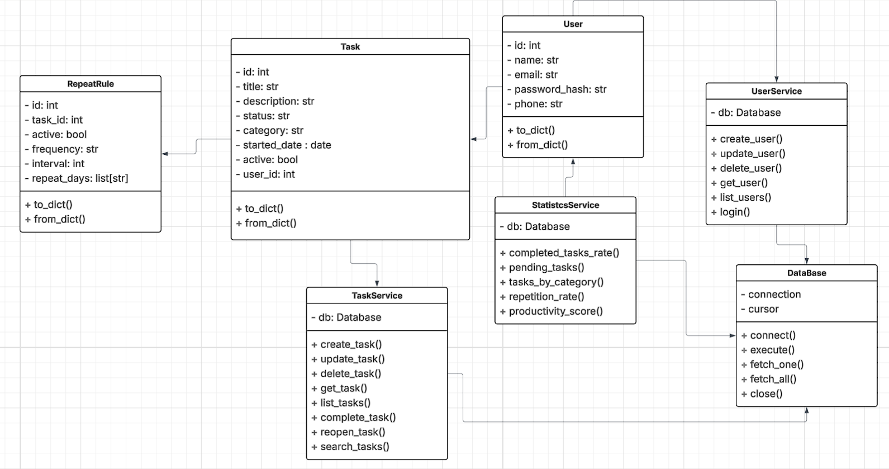
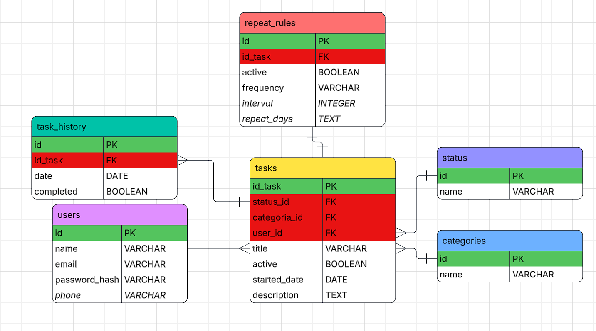

# Task Manager

**Project:** My First Project  
**Start Date:** April 28, 2026  

## Description
This is my first personal project, developed with the goal of learning and strengthening my programming skills. Through this project, I aim to improve my logic, code organization, and the use of real development tools.

The project has been redesigned and restructured to achieve a cleaner architecture, improve scalability, simplify documentation, and make future features easier to implement and maintain.

## Technologies
- Python  
- MySQL  
- Git and GitHub  

## Status
Under development 🚧  

## Project Refactor
**Refactor Date:** May 13, 2026  

The project architecture was redesigned to:

- Create a cleaner and more organized structure
- Make the project easier to expand in the future
- Improve code maintainability
- Simplify project documentation
- Improve separation of responsibilities
- Make task repetition logic easier to implement and manage
- Prepare the project for more advanced features and scalability

## UML Diagram
The following diagram represents the current architecture and design of the project.

## Entity-Relationship Diagram (ERD)
This diagram represents the database structure, including tables, relationships, and constraints used in MySQL.

## Database
The project includes a `task_manager.sql` file with the necessary instructions to create the database and its tables in MySQL.

## Objective
Build a functional task manager by applying good practices such as:

- Object-oriented programming (OOP)
- Error handling
- Modular code organization
- Database design and normalization
- Proper use of Git and GitHub  

## Notes
This project is constantly improving and evolving as part of my learning process. The current version reflects an important architectural refactor focused on writing cleaner, more scalable, and more maintainable code.